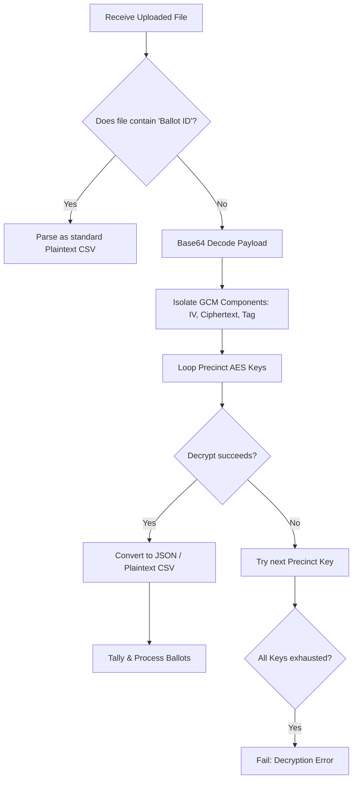

# Demokratia Central Server (Audit & Tally Portal)

Demokratia Central Server is the central tally, auditing, and visualization platform. It securely receives streamed ballot batches from local precinct counting terminals, manages precinct AES cryptographic keys, decrypts flash drive uploads, and displays live election tallies.

---

## Key Features

1. **Top Navbar Responsive Layout:** Cohesive, modern centralized layout aligned with the client design, supporting smooth theme persistence.
2. **Batch Transmissions & Audits:** Receives and logs real-time encrypted ballot streams over the network.
3. **Decryption Engine:** Symmetrically decrypts GCM-encrypted `.acm` and `.csv` payloads using precinct-specific AES keys.
4. **Offline Import Processing:** Multi-precinct auto-detecting decryption loop for encrypted CSVs and ACM files.
5. **Real-time Tallies:** Displays aggregated election returns with visual candidates and voting cards.

---

## How It Works (Decryption Engine)



---

## Getting Started

### Prerequisites

- PHP 8.3+
- Node.js 20+ & NPM
- Composer

### Installation & Run Steps

1. **Install Dependencies:**
   ```bash
   composer install
   npm install
   ```

2. **Configure Environment:**
   Copy `.env.example` to `.env` and configure your local SQLite database:
   ```bash
   cp .env.example .env
   touch database/database.sqlite
   ```

3. **Run Migrations & Seeders:**
   ```bash
   php artisan migrate --seed
   ```

4. **Compile Assets:**
   ```bash
   npm run build
   # Or for development:
   npm run dev
   ```

5. **Start Local Server:**
   ```bash
   php artisan serve --port=8000
   ```
   Open `http://localhost:8000` in your browser.

---

## Testing

Run the feature and unit test suites:
```bash
php artisan test
```
